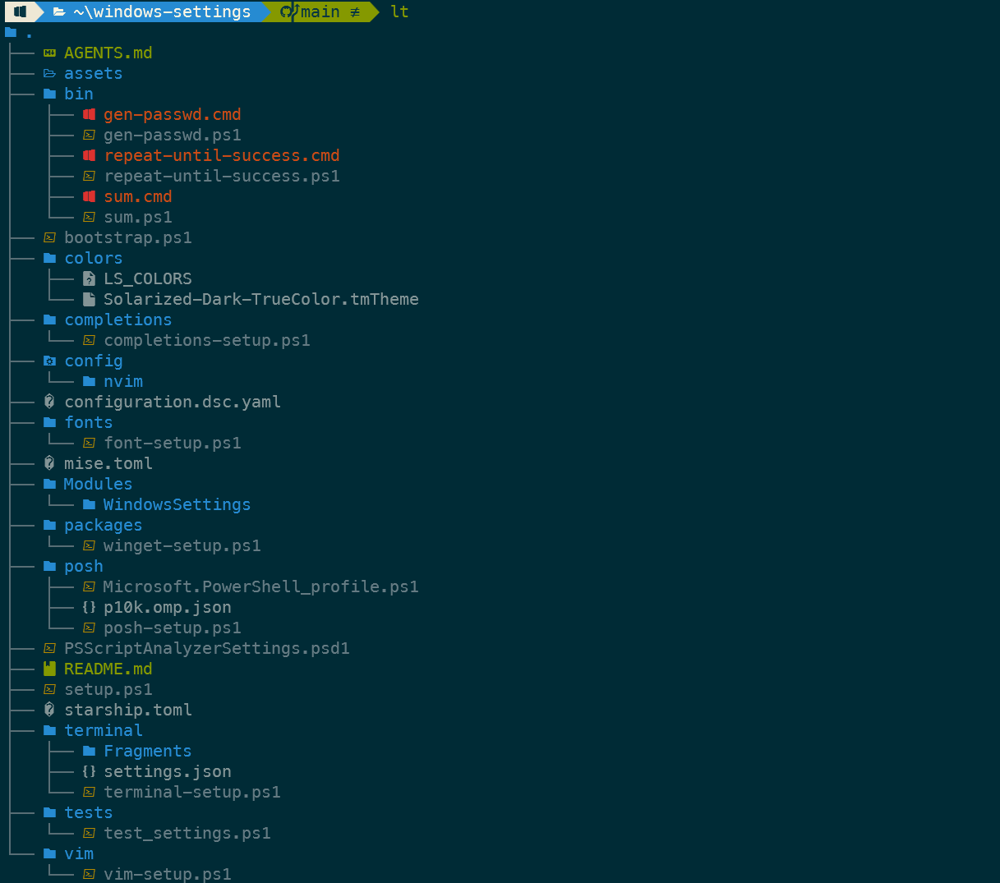
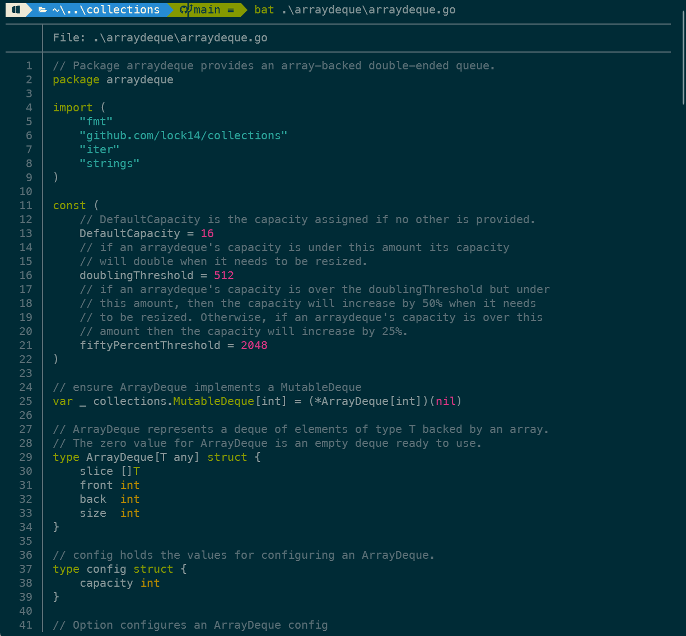
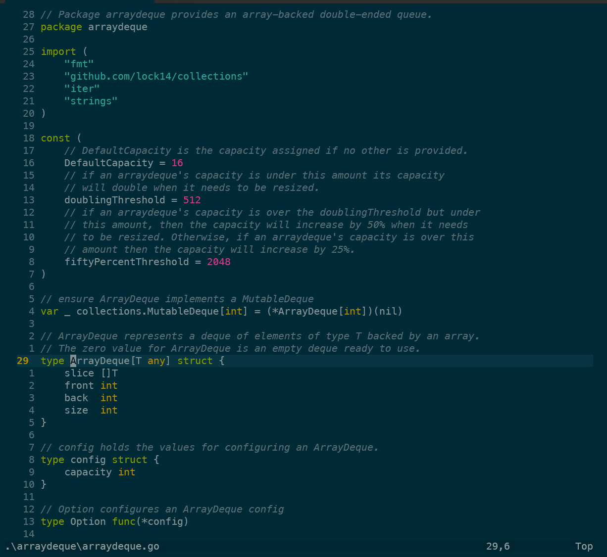

# windows-settings

[](https://github.com/lock14/windows-settings/actions/workflows/ci.yml)

Modern Windows developer workstation configuration and setup automation for **PowerShell 7+**, **Oh My Posh**, **Neovim**, and **Windows Terminal**.

---

## Showcase

<p align="center">
  
  <br>
  <em>Oh My Posh Powerline prompt, predictive IntelliSense, and <code>eza</code> directory tree</em>
</p>

<p align="center">
  
  <br>
  <em>24-bit TrueColor syntax highlighting and Git gutter integration via <code>bat</code> / <code>cat</code></em>
</p>

<p align="center">
  
  <br>
  <em>Modern Lua Neovim in Solarized Dark with Native LSP (Go, Terraform, Python) and Treesitter AST highlighting</em>
</p>

---

## Architecture Overview

```text
windows-settings/
├── configuration.dsc.yaml         # WinGet DSC v3 declarative machine configuration
├── posh/p10k.omp.json             # Single-line Powerlevel10k Solarized Dark theme
├── mise.toml                      # Declarative polyglot toolchains & CLI tools (Java, Go, Python, Node, Rust, etc.)
├── bootstrap.ps1                  # Turnkey zero-dependency one-liner bootstrapper
├── setup.ps1                      # Master setup engine
│
├── Modules/
│   └── WindowsSettings/           # Native PowerShell module (autoloaded, zero profile hacks)
│       ├── WindowsSettings.psd1
│       ├── WindowsSettings.psm1
│       ├── Public/                # Git shortcuts, developer tools, navigation, utilities
│       └── Completions/           # Dynamic CLI argument completions
│
├── config/
│   └── nvim/                      # Modern Lua Neovim (Mason LSP, Treesitter, Telescope)
│       └── init.lua
│
├── terminal/
│   └── Fragments/                 # Windows Terminal JSON fragment extension (zero-touch)
│       └── windows-settings.json
│
├── bin/                           # Native CLI utilities (gen-passwd, repeat-until-success, sum)
└── tests/
    └── test_settings.ps1          # 128 automated tests across all 8 test modules
```

---

## Prerequisites

- **PowerShell 7+** (`pwsh`)
- **Git for Windows**
- **Windows Terminal**
- **winget** (Windows Package Manager, included in Windows 10/11)

---

## Quick Start

### 1. Turnkey Bootstrap (New Machines)

Stream and run directly in PowerShell 7 (`pwsh`) without pre-cloning:

```powershell
irm https://raw.githubusercontent.com/lock14/windows-settings/main/bootstrap.ps1 | iex
```

### 2. Declarative WinGet Configuration (Microsoft DSC v3)

Provision the complete workstation toolchain natively via Microsoft DSC:

```powershell
winget configure .\configuration.dsc.yaml
```

### 3. Automated Master Setup (Existing Clone)

```powershell
git clone https://github.com/lock14/windows-settings.git
cd windows-settings

# Full automated bootstrap
.\setup.ps1 -Bootstrap

# User dotfiles only (module, prompt, nvim, terminal fragments)
.\setup.ps1 -DotfilesOnly

# Preview actions without making system changes
.\setup.ps1 -DryRun
```

### 4. Command-Line Options (`setup.ps1` & `bootstrap.ps1`)

| Option | Default | Description |
| :--- | :--- | :--- |
| `-Bootstrap` | *disabled* | Full new machine bootstrap (packages, fonts, prompt, module, terminal, nvim) |
| `-DotfilesOnly` | *disabled* | Configure user dotfiles, fonts, nvim, terminal, and shell module only (no package install) |
| `-SystemOnly` | *disabled* | Provision winget packages and CLI tools only |
| `-UseDSC` | *disabled* | Provision workstation packages using declarative WinGet DSC manifest (`configuration.dsc.yaml`) |
| `-DryRun` | *disabled* | Preview actions without modifying the system |
| `-WithGUI` / `-IncludeGUI` | *disabled* | Install GUI desktop applications (VS Code, Windows Terminal, Docker Desktop via winget) |
| `-SkipPackages` | *disabled* | Skip winget package installation |
| `-SkipFonts` | *disabled* | Skip MesloLGS NF font installation |
| `-SkipPosh` | *disabled* | Skip Oh My Posh & PowerShell module configuration |
| `-SkipCompletions` | *disabled* | Skip CLI argument completions registration |
| `-SkipTerminal` | *disabled* | Skip Windows Terminal settings & JSON fragment deployment |
| `-SkipVim` | *disabled* | Skip Neovim & Vim configuration |
| `-SkipBin` | *disabled* | Skip adding `bin/` directory to User PATH |

---

## What's Included

### 1. Single-Line Powerlevel10k Prompt (`posh/p10k.omp.json`)
- Flawless dynamic Powerline transitions powered by **Oh My Posh**.
- **Dynamic Git State Shifting**: Turns **Green** when clean, **Yellow** when modified/staged, **Orange** when diverged, **Cyan** when ahead.
- Left side: OS glyph $\to$ Directory (``) $\to$ Git branch & status.
- Right side (`rprompt`): Node, Go, Python, .NET, Rust, AWS context, execution duration, and exit status.
- **High-Speed Disk Caching**: Compiles prompt hook into `$HOME\.cache\powershell\omp_init.ps1` for sub-second startup (<10ms).

### 2. First-Class PowerShell Module (`WindowsSettings`)
- Clean autoloaded PowerShell Module (`$HOME\Documents\PowerShell\Modules\WindowsSettings`).
- Clean 1-line `$PROFILE`:
  ```powershell
  Import-Module WindowsSettings
  ```
- Instant updates via `git pull` without modifying or corrupting profile files.

### 3. Modern Rust CLI Developer Toolchain
- **`eza`**: Modern `ls` with Git status, icons, and tree views (`ls`, `ll`, `la`, `lt`).
- **`zoxide` (`z`)**: Frecency-based smart directory jumping.
- **`bat`**: Syntax-highlighted paging with Git modification markers.
- **`uutils-coreutils`**: Fast, memory-safe compiled Rust GNU coreutils.
- **`PSReadLine`**: Predictive IntelliSense and interactive fuzzy history search (`Ctrl+R`) via `fzf`.

### 4. Git & Developer Shortcuts
Includes the full Oh My Zsh Git plugin suite and developer workflow helpers:

| Shortcut | Description |
| :--- | :--- |
| `Ctrl+R` | Interactive fuzzy search command history via `fzf` |
| `z <dir>` | Smart jump to directory via `zoxide` |
| `cat <file>` | Syntax-highlighted file viewing via `bat` |
| `gco` | `git checkout` |
| `gcb` | `git checkout -b` |
| `gcm` | `git checkout main` (or `master`) |
| `ga` / `gaa` | `git add` / `git add --all` |
| `gst` / `gss` | `git status` / `git status -s` |
| `gd` / `gds` | `git diff` / `git diff --staged` |
| `gl` / `gp` | `git pull` / `git push` |
| `gb` / `gba` / `gbd` | `git branch` (list / all / delete) |
| `gsta` / `gstp` / `gstl` | `git stash` (push / pop / list) |
| `glog` / `glo` | `git log --graph` / `git log --oneline` |
| `grb` / `grbc` / `grba` | `git rebase` / `--continue` / `--abort` |
| `gcommit` | `git add -A && git commit` |
| `gamend` | `git add -A && git commit --amend --no-edit` |
| `gup` | `git fetch && git pull --rebase origin HEAD` |
| `gprune` | Delete local branches except `main`/`master` |
| `gsync` | Rebase current branch onto latest `main`/`master` |
| `guser-branch` | Prefix branch with `$USER/` (stripping redundant prefixes) |
| `go-testall` | `go test ./...` |
| `go-buildall` | `go build ./...` |
| `go-lint` | `golangci-lint run` (with auto-cached configuration) |
| `tf` | `terraform` |
| `vi` / `vim` / `v` | `nvim` (Modern Lua Neovim) |
| `yaml-lint` | `yamllint -c ~/.yamllint.yml` |
| `ls` | Modern directory listing (`eza --icons=auto`) |
| `ll` | Detailed directory listing with Git status (`eza -la --git`) |
| `la` | List all files including hidden (`eza -a`) |
| `lt` | Tree view listing (`eza --tree --level=2`) |
| `fs` | Fast recursive directory tree search (`fd` + `Format-PathTree`) |

### 5. Modern Lua Neovim (`config/nvim/init.lua`)
- Lua-first Neovim configuration with **Lazy.nvim**.
- **Native LSP (`mason.nvim` + `nvim-lspconfig`)**: Auto-manages Go (`gopls`), Terraform (`terraform-ls`), Python (`pyright`), YAML.
- **Tree-sitter**: AST-based syntax highlighting.
- **Telescope**: Fast in-editor fuzzy file finding (`<leader>ff`, `<leader>fg`).
- **Solarized Dark**: Seamless `#002B36` terminal background matching.

### 6. Zero-Touch Windows Terminal (`terminal/Fragments/`)
- Native Windows Terminal JSON Fragment extension (`terminal/Fragments/windows-settings.json`).
- Automatically loads Solarized Dark, MesloLGS NF font, and keybindings without ever modifying `settings.json` or conflicting with WSL profiles.

---

## Testing & Quality Gates

Run the automated test suite locally:

```powershell
pwsh -NoProfile -File ./tests/test_settings.ps1
```

Runs **128 automated tests across all 8 modules**:
1. PowerShell Script & Module Syntax
2. JSON, YAML & Manifest Validity (`configuration.dsc.yaml`, `p10k.omp.json`, `settings.json`, fragments)
3. WindowsSettings Module Import & Function Exports (60 functions)
4. Native CLI Utilities & Pipeline Handling (`sum`, `gen-passwd`, `repeat-until-success`)
5. Git Workflow Behavior (`gsync`, `gprune`, `guser-branch`, `fix-abcxyz-branch-name`)
6. Completions & Prompt Rendering
7. Path Invariants & Dual Execution Wrappers
8. Setup Script Idempotency, DryRun & Backup Policy
